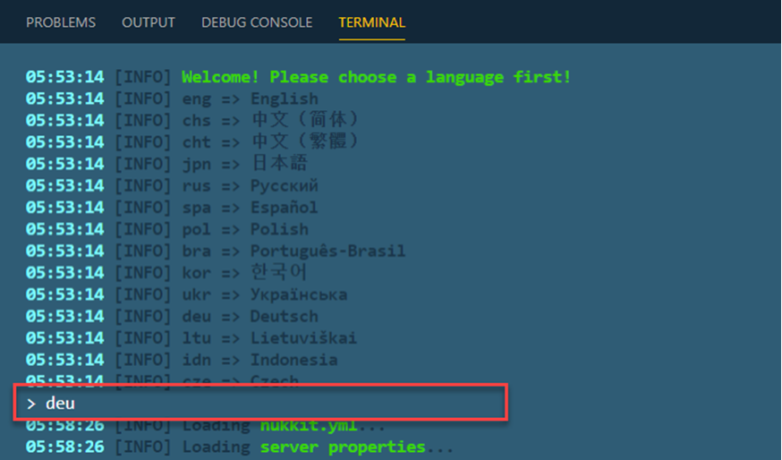

# Minecraft Game Server

## Install the Minecraft Server

Install Java:

```
sudo apt install openjdk-8-jre-headless
```

Download & Install the Nukkit server software

```
mkdir nukkit
cd nukkit
wget -O nukkit.jar http://ci.mengcraft.com:8080/job/nukkit/lastSuccessfulBuild/artifact/target/nukkit-1.0-SNAPSHOT.jar
sudo java -jar nukkit.jar
```

Choose your Language:



> Note: `Nukkit` is nuclear-powered server software for [Minecraft: Pocket Edition](https://github.com/NukkitX/Nukkit).

# Configure Your Minecraft Server

Edit Configuration:

```
sudo nano nukkit.yml
```

Paste the following Configuration & hit `CTRL+O` and the ENTER to write the file `nukkit.yml`

```
max-players=10
pvp=on
difficulty=1
```

> Note: A full list of properties is documented in the [Minecraft Pedia](https://minecraft.gamepedia.com/Server.properties)

Now you can start the Minecraft Server:

```
sudo java -jar nukkit.jar
```
