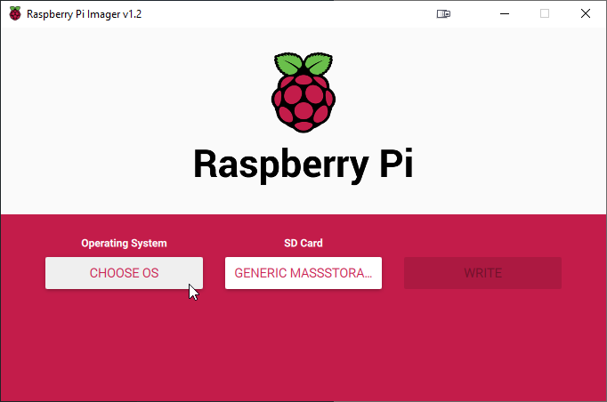

# Setup

Download Raspberry Imager:

[Raspberry Downloads](https://www.raspberrypi.org/downloads/)

[Imager for Windows](https://downloads.raspberrypi.org/imager/imager.exe)

Then choose Operating System (OS) Image & Card




---

## Headless OS Setup

Connect to the raspi using a network cable.

After completion add a blank file with the name `ssh` without any extension. This file will be deleted after you have established the first connection.

The default Newtwork Name of the raspi is `raspberrypi`. If you want to find the IP Address of your Raspberry you could use a network scanner like [Advanced IP Scanner](https://www.advanced-ip-scanner.com/de/) or the DHCP table of your router


> Note: You might want to adjust the IP range you are scanning

Install the SSH Client [PuTTY](https://www.chiark.greenend.org.uk/~sgtatham/putty/latest.html) or use the SSH Client provided by your Remote Client OS.

Connect to the Raspberry using Windows Command Shell (Windows + R -> CMD)

```bash
ssh pi@raspberrypi
```

> Note: The default password is "raspberry"

Configure the raspi:

```
sudo  raspi-config
```

> Note: To install Ubuntu Server on the raspi follow this [guide](https://ubuntu.com/tutorials/how-to-install-ubuntu-on-your-raspberry-pi#1-overview)

### Connect to the WiFi

Connect the raspi to your local wifi - you will need your Network SSID and the password:


> Connect to your WiFi Network using your SSID & password

Update the raspi to check if Network Config works:


You should see a screen similar to this:


> Note: In real life you should also change the device name & sudo password

After you finished this configuration choose `finish` to exit the `raspi-config` screen.

Next check your IP Address:

```
ifconfig
```


## Enable RDP access

Install RDP on raspi:

```
sudo apt-get update
sudo apt-get install xrdp
```

Connect to raspi from your Windows Client:

```
 mstsc /v:192.168.1.140
```


> Note: Logon using your credentials


Congratulations David! You have now completed the first lecture!

## Optional - IP Address Management

Release IP:

```
sudo dhclient -v -r
```
